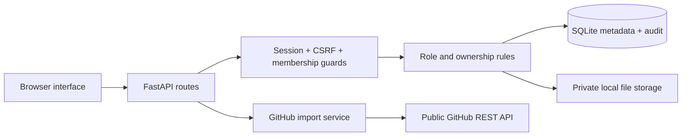

# TeamDocs

**A shared document workspace with clear ownership, review workflows, and tenant-aware access.**

Built for Week 1 of the Production-Grade AI & LLM Systems Bootcamp. This project turns the five days of engineering foundations into one working application: sign in, upload a document, approve it, export the register, and verify the access boundaries through the API.

TeamDocs is a document-management foundation for future AI workflows. It does **not** claim to provide AI answers, malware scanning, or enterprise-grade compliance.

## Run in two commands

Requires Docker with the Compose plugin:

```bash
cp .env.example .env
docker compose up --build
```

Open **http://127.0.0.1:8000**. The included Compose setup binds only to localhost and explicitly enables sample accounts. No API keys are needed. Public GitHub README import requires internet access; the other features work offline.

### Run without Docker

Requires Python 3.12. From the repository root:

```bash
python3 -m venv .venv
source .venv/bin/activate
python -m pip install -r requirements.txt
DEMO_MODE=true uvicorn app.main:create_app --factory --host 127.0.0.1 --port 8000
```

On Windows PowerShell, activate with `.venv\Scripts\Activate.ps1`, set `$env:DEMO_MODE="true"`, then run the same `uvicorn` command without the `DEMO_MODE=true` prefix.

The Python command reads process environment variables; it does not automatically load `.env`. Compose reads `.env` for the provided substitutions.

## Try the demo

Use the role buttons on the login screen, or sign in manually. All sample accounts use **`DemoPass123!`**.

| Account | Role | Workspace |
|---|---|---|
| `admin@teamdocs.demo` | Administrator | Northstar Studio |
| `member@teamdocs.demo` | Member | Northstar Studio |
| `viewer@teamdocs.demo` | Viewer | Northstar Studio |
| `other@teamdocs.demo` | Administrator | Orbit Labs |

1. Sign in as **Administrator** and upload [`sample-files/launch-plan.md`](sample-files/launch-plan.md).
2. Find the new document in **Needs review**, then approve it with the checkmark.
3. Download the file and export the document register as CSV.
4. Open **Activity log** to see the actual upload, approval, download, and export events.
5. Sign out and choose **Viewer**. Browse and download; upload, approval, deletion, and export are unavailable.
6. Sign in to **Orbit Labs**. Its separate library contains only its own document.

Every sample document is shared with all members of its workspace. Members may delete only their own uploads; administrators may delete any document in their workspace. There is no private-within-workspace sharing mode.

## What works

- **Authentication:** Argon2 password hashes, opaque server-side sessions, HttpOnly / SameSite cookies, expiration and logout revocation.
- **Authorization:** workspace-scoped memberships, role permissions, ownership checks, and CSRF tokens on authenticated mutations. Permissions are read from the database on each request, so demotion affects existing sessions.
- **Document workflow:** PDF/TXT/Markdown/CSV uploads up to 5 MB, generated storage keys, bounded validation, protected downloads, approval, deletion, categories, search and pagination.
- **External API integration:** import public GitHub READMEs through a fixed-host HTTP client with timeouts, bounded response size, one retry for selected transient failures, and explicit upstream error mapping.
- **Export:** streamed CSV register with formula-prefix neutralization for spreadsheet safety.
- **Performance:** indexed tenant/date queries, joined owner lookup to avoid N+1 queries, bounded page sizes and gzip for larger responses.
- **Operations:** structured request logs, request IDs, application metrics for administrators, audit records, liveness/readiness endpoints, and backup verification scripts.
- **Delivery:** pinned dependencies, a non-root Docker image, persistent volume, and GitHub Actions for API tests, JavaScript syntax, image build and container startup.

## Architecture



```text
app/
  main.py          App factory, routes, document orchestration, demo seed
  security.py      Session lookup, CSRF, tenant context, permission policy
  services.py      File validation and GitHub integration
  db.py            Schema, indexes, transactional connection boundary
  static/          HTML, CSS, JavaScript, favicon
tests/             Isolated API and mocked upstream integration tests
scripts/           Security demo, provisioning, backup and restore verification
docs/              Curriculum mapping, architecture decisions, Loom script
sample-files/      A ready-to-upload demo document
```

The frontend and API share an origin. Cross-origin access is not enabled; no permissive CORS configuration is needed. SQLite keeps setup simple and reproducible. The application deliberately runs in one process; multi-instance deployments require changes listed below.

## Tests and security demonstration

```bash
python -m pytest -q
node --check app/static/app.js
# With the demo server running:
python scripts/security_demo.py
```

Tests cover role restrictions, ownership, cross-tenant resource IDs, CSRF, expiration, logout, role demotion in existing sessions, last-administrator protection, malformed/oversized uploads, approval, export escaping, search/pagination, query-plan index selection, login rate limits, and GitHub failure handling. Tests use temporary databases and do not touch the demo workspace.

The security demonstration makes real HTTP requests as the viewer and reports:

```text
PASS  Read own workspace                     HTTP 200
PASS  Export as a viewer                     HTTP 403
PASS  Access another workspace               HTTP 404
PASS  Guess another tenant document ID       HTTP 404
```

## API reference

Open `/docs` for the generated API explorer or `/openapi.json` for the schema. The interactive explorer needs internet access for its UI assets. Sign in through the application first. Authenticated mutation requests also need `X-CSRF-Token`, obtained from `/api/auth/me`; use an HTTP client for those requests.

| Method | Route | Purpose |
|---|---|---|
| POST | `/api/auth/login` | Start a session |
| GET | `/api/auth/me` | Current user, CSRF token and workspaces |
| POST | `/api/auth/logout` | Revoke the session |
| GET / POST | `/api/v1/workspaces/{tenant}/documents` | List / upload |
| GET | `…/documents/{id}/download` | Authorized file download |
| POST | `…/documents/{id}/approve` | Administrator approval |
| DELETE | `…/documents/{id}` | Owner or administrator deletion |
| POST | `…/imports/github` | Import a public README |
| GET | `…/export` | Export the workspace register |
| GET / PATCH | `…/members` / `…/members/{id}` | List members / update role |
| GET | `…/audit` | Paginated audit events |
| GET | `…/metrics` | Process-level request counters and mean latency |
| GET | `/health/live`, `/health/ready` | Liveness / dependency readiness |

Errors have a consistent `error` object with `code`, `message`, and normally a `request_id`. Unknown resources and resources in another tenant both return 404.

## Configuration

| Variable | Default in application | Purpose |
|---|---|---|
| `DEMO_MODE` | `false` | Explicitly seed sample accounts into an empty database |
| `DATA_DIR` | `./data` | Database and private files |
| `COOKIE_SECURE` | `false` | Set `true` behind HTTPS |

To create a fresh non-demo workspace:

```bash
python scripts/create_admin.py --email you@example.com --name 'Your Name' --workspace 'Your Workspace' --data-dir private-data
DATA_DIR=./private-data DEMO_MODE=false COOKIE_SECURE=true uvicorn app.main:create_app --factory
```

The second command assumes an HTTPS reverse proxy; secure cookies do not work with plain HTTP. The bootstrap command is for an empty database only. Disabling demo mode does **not** remove already-seeded accounts: use a fresh data directory for non-demo use.

## Backups and restoration

For a local Python deployment, stop the application first so file and database snapshots agree:

```bash
python scripts/backup.py --data-dir data --output backups --app-stopped
python scripts/restore_check.py backups/<printed-timestamp>
```

Restore to a **new directory**, never over a running database:

```bash
cp -R backups/<printed-timestamp> restored-data
DATA_DIR=./restored-data DEMO_MODE=false uvicorn app.main:create_app --factory --port 8001
```

Sign in and download a known document to complete the restore drill. Sessions are intentionally removed from backups. For Docker, stop the Compose service and use a one-off container with the data volume mounted to run the same script; export the backup outside the application volume. Backups contain confidential documents and password hashes and need their own access control and encryption.

## Design boundaries and next steps

This is a tested bootcamp application, **not a production security certification**.

- File validation checks extension, size, text encoding and basic PDF structure. It does not scan malware or fully validate PDF internals. Untrusted files are served as attachments and are never rendered or executed by the app.
- Filesystem writes and SQLite commits are not one atomic transaction. Upload failures attempt cleanup; crash recovery needs an orphan-file reconciliation job. A failed post-delete file cleanup can leave an inaccessible orphan.
- Rate limiting and operational metrics are in memory and process-local. Production needs shared rate-limit storage, durable metrics, latency histograms, alerts and distributed tracing. An administrator can see aggregate process metrics, not tenant-specific metrics.
- Audit events are database records, not a tamper-proof external log. Some ownership/tenant rejection paths are visible in request logs rather than audit records. Do not treat this as a complete security-event archive.
- No signup, invitations, password reset, MFA, OAuth, object storage, background job queue, or full-text search is included. Roles can be changed for existing members.
- Response caching is intentionally disabled for private API data. No authorization-sensitive cache is introduced just to demonstrate caching.
- SQLite and local files fit a single-instance demo. Multiple replicas need shared storage and a database appropriate to the deployment.
- CI verifies build/startup and tests; it does not deploy automatically. A health check alone does not guarantee recovery or availability.
- HTTPS, trusted proxy configuration, operational secret management, quotas, retention and off-machine backups are deployment responsibilities.

## Submission material

- [Days 1–5 evidence map](docs/CURRICULUM.md)
- [Architecture and design decisions](docs/ARCHITECTURE.md)
- [2–3 minute Loom script and recording checklist](docs/LOOM_SCRIPT.md)
- [Submission checklist](docs/SUBMISSION.md)

Use the actual GitHub Actions result as validation evidence. Record your own walkthrough in Loom and paste the recording link into the assignment submission and email reply as instructed by the bootcamp.
